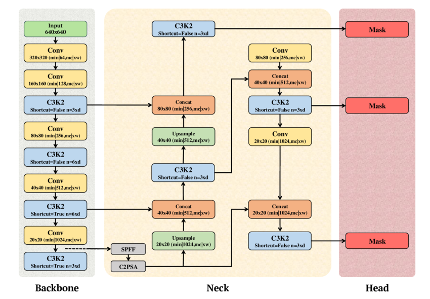
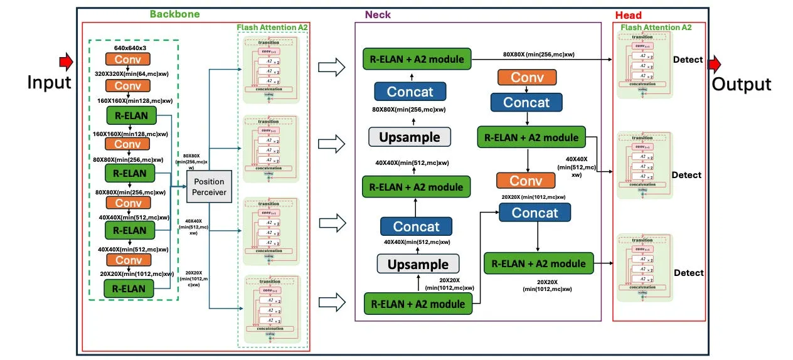
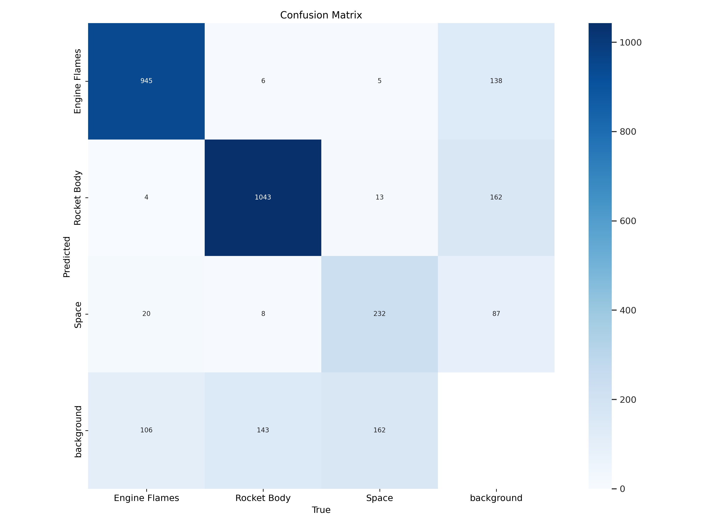
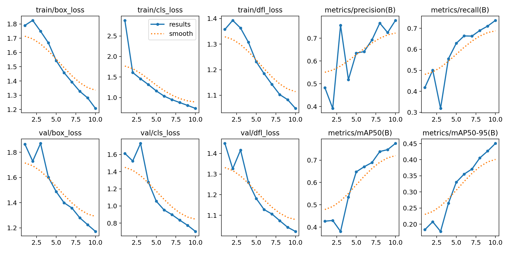
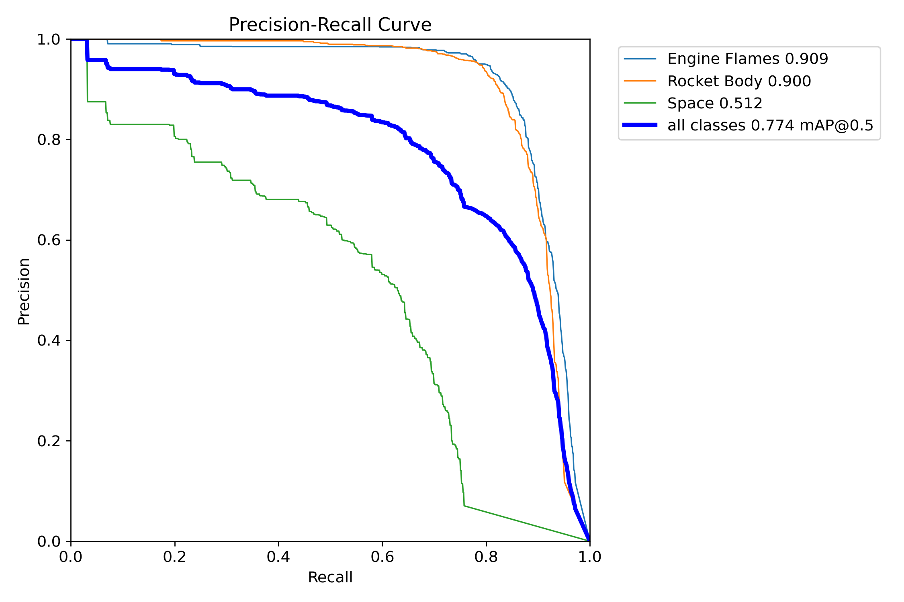
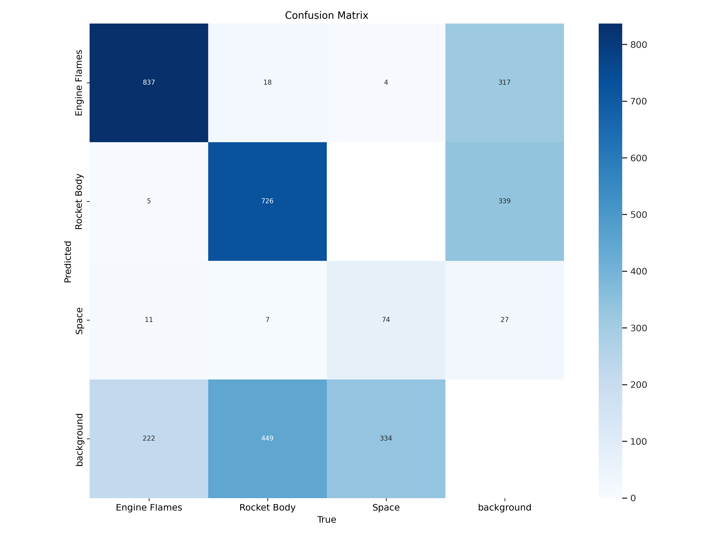
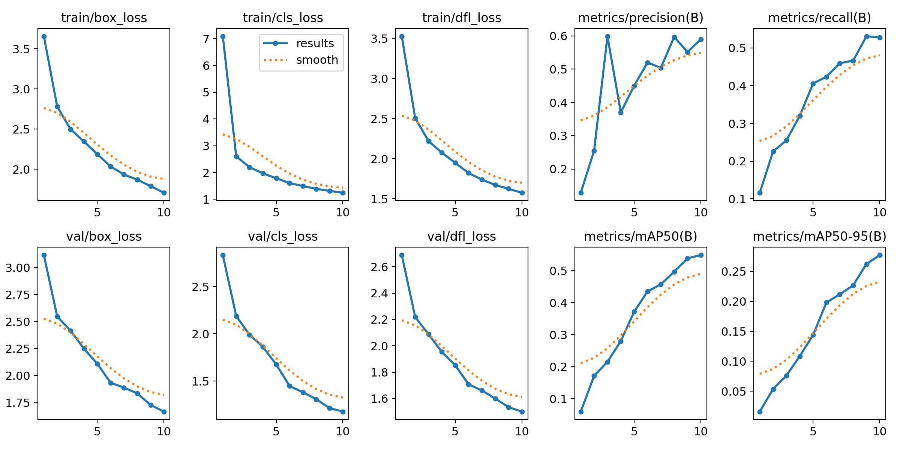
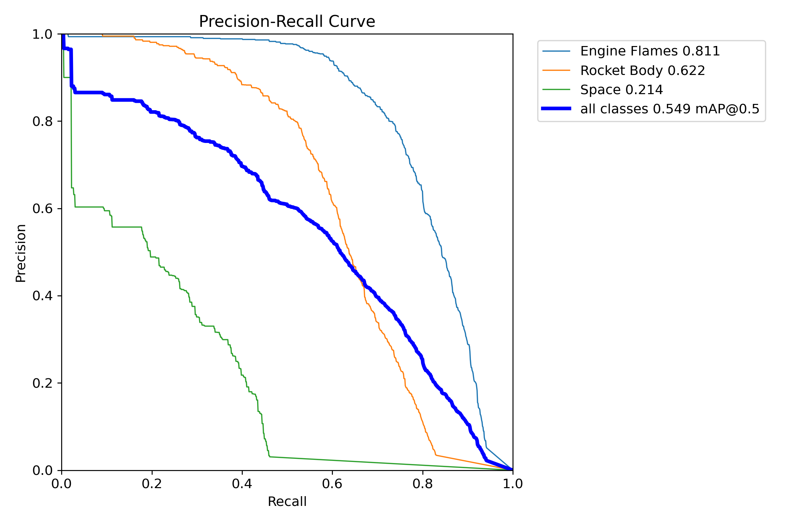

# ML-CA Report
# Rocket Detection using YOLOv11 and YOLOv12

## Overview

This project is specifically made to address challenges that we face while doing small object detection. Small object 
are just objects that cover less than 100 pixels in a given image. It is particularly hard for models to learn features 
because of the small and unclear edges of any given object in an image. However, despite these challenges, Ultralytics
has created several models over the years to tackle the problem of small object detection.  

**Problem Statement**: Small object detection (Rocket) using YOLO v11 and YOLO v12 computer vision models.

---

## Dataset Source

**Source**: NASASpaceflight Rocket Detect Dataset.

**Link** : https://universe.roboflow.com/nasaspaceflight/rocket-detect/dataset/36

### Dataset Size

`1.` 12041 annotated images

`2.` Three object classes:
 - **Engine Flames**: Fire generated by rocket engines.
 - **Rocket Body**: Main body of the rocket.
 - **Space**: very small and tiny  distant rockets.

### Preprocessing & Augmentation

`1.` Image resize 640×640 pixels (standard YOLO input)

`2.` Normalization (pixel values scaled to 0-1)

`3.` Data augmentation techniques applied:
   - Random rotations (±15 degrees)
   - Horizontal flips 
   - Brightness and contrast adjustments 
   - Mosaic augmentation (YOLO-specific)

`4.` Train/Validation/Test split: 70/20/10

---

## Methods

### Approach

Two YOLO architectures are used for this project:

**YOLOv11**:
1. Better feature extraction
2. Better backbone architecture
3. Optimized efficiency with 22% less parameters than YOLOv8
4. Fast processing speed with constant accuracy
5. Multiscale detection layers for different object sizes

**YOLOv12**:
1. New attention-centric architecture with Area Attention mechanism
2. R-ELAN (Residual Efficient Layer Aggregation Networks) for good feature aggregation
3. FlashAttention integration for less memory overhead
4. Great accuracy across each and every model with small speed trade-offs

### Architecture Diagrams

#### YOLOv11 Architecture

*Figure 1: Diagram of YOLOv11 illustrating its three core components: Backbone, Neck, and Head.*
#### YOLOv12 Architecture

*Figure 2: Diagram of YOLOv12 illustrating its three core components: Backbone, Neck, and Head.*

### Why This Approach?
We need good balance of speed and accuracy for this type of work. YOLOv11 and YOLOv12 are the latest iterations 
with architectural improvements suited for the following tasks: 
- Real-time inference 
- Detecting objects at sizes (small distant rockets to large close-up bodies)
- Handling motion blur and different lighting conditions

### Alternative Approaches Considered

| Method | Advantages                       | Disadvantages | Why Not Chosen |
|--------|----------------------------------|---------------|----------------|
| Faster R-CNN | good precision on complex scenes | Slow inference (~5 FPS) | Not real-time capable |
| SSD | Good balance of speed/accuracy   | Lower accuracy on small objects | Critical for detecting distant rockets |
| EfficientDet | Efficient architecture           | Slower than YOLO variants | Speed priority for tracking |

### Model Comparison

| Feature | YOLOv11                     | YOLOv12                             |
|---------|-----------------------------|-------------------------------------|
| Architecture | CNN-based enhanced backbone | Attention-centric with transformers |
| Parameters (medium) | 20.2M                       | 20.2M                               |
| Inference Speed (T4) | 4.86ms                      | 4.86ms                              |
| mAP Strength | Precision-focused           | Recall-focused                      |
| Best For | Speed-based applications    | accuracy-based applications         |

---

## Steps to Run

### Prerequisites
Ensure you have the following installed:
- Python 3.8+
- PyTorch 2.0+
- Ultralytics library
- CUDA-enabled GPU (recommended)

### 1. Setup Environment
Install required dependencies with pip or conda package manager.

### 2. Prepare Dataset
Load the NASASpaceflight Rocket Detect dataset using roboflow functions in yolov8 format. 

### 3. Train YOLOv11
Load the pretrained YOLOv11 model and train it.

### 4. Train YOLOv12
Load the pretrained YOLOv12 model and train it.

### 5. Validate Models
Compute the performance metrics (mAP, precision, recall) on the test set.

### 6. Run Inference
Do inference on new rocket images to get a visual overview of what the model has learned.

---

## Experiments & Results

### Training Configuration
- **Optimizer**: AdamW
- **Learning Rate**: 0.001 
- **Batch Size**: 16
- **Epochs**: 10
- **Image Size**: 640×640
- **Augmentation**: Mosaic, flip, brightness/contrast (This is done automatically)

### Model Performance Comparison

| Metric / Class   | YOLOv11s | YOLOv12s |
|------------------|-----------|-----------|
| **Framework** | Ultralytics 8.3.40 | Ultralytics 8.3.63 |
| **Layers** | 238 | 376 |
| **Parameters** | 9,413,961 | 9,075,369 |
| **GFLOPs** | 21.3 | 19.3 |
| **Images Evaluated** | 2376 | 2376 |
| **Instances** | 2687 | 2687 |

### Overall Metrics
| Metric | YOLOv11s | YOLOv12s |
|--------|-----------|-----------|
| Precision | 0.777 | 0.59 |
| Recall | 0.737 | 0.529 |
| mAP@50 | 0.774 | 0.549 |
| mAP@50–95 | 0.450 | 0.278 |

### Class-wise Metrics
| Class | Metric | YOLOv11s | YOLOv12s |
|--------|---------|-----------|-----------|
| Engine Flames | Precision | 0.863 | 0.659 |
| Engine Flames | Recall | 0.860 | 0.789 |
| Engine Flames | mAP@50 | 0.909 | 0.811 |
| Engine Flames | mAP@50–95 | 0.599 | 0.460 |
| Rocket Body | Precision | 0.843 | 0.614 |
| Rocket Body | Recall | 0.848 | 0.600 |
| Rocket Body | mAP@50 | 0.900 | 0.622 |
| Rocket Body | mAP@50–95 | 0.582 | 0.313 |
| Space | Precision | 0.624 | 0.496 |
| Space | Recall | 0.504 | 0.197 |
| Space | mAP@50 | 0.512 | 0.214 |
| Space | mAP@50–95 | 0.170 | 0.061 |

### Inference Speed
| Stage | YOLOv11s (ms/img) | YOLOv12s (ms/img) |
|--------|--------------------|--------------------|
| Preprocess | 0.1 | 0.1 |
| Inference | 2.4 | 3.7 |
| Loss | 0.0 | 0.0 |
| Postprocess | 1.3 | 0.9 |

### Graphs Results

#### YOLOv11s

--- 

#### YOLOv12s

---

## Conclusion
While YOLOv11s is better than YOLOv12s in this experiment, the choice may depend on the specific use case if 
higher precision and recall are essential, YOLOv11s is better. If speed is more important factor, YOLOv11s also has an 
edge here.

1. YOLOv11s shows significantly higher overall precision, recall, and mAP scores compared to YOLOv12s, indicating it performs better across most metrics.
2. YOLOv12s has somewhat higher mAP@50 and mAP@50–95.
3. Inference speed is faster in YOLOv11s making it more efficient.
---

## References

1. https://docs.ultralytics.com/
2. https://docs.ultralytics.com/models/yolo12/
3. https://docs.ultralytics.com/models/yolo11/

---

